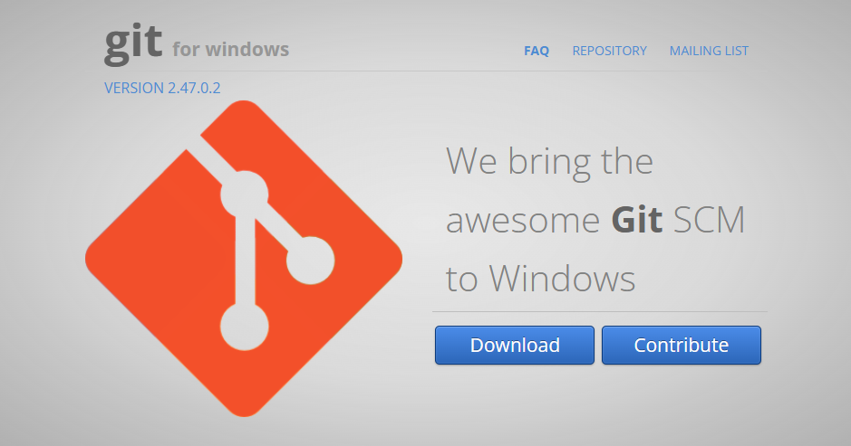
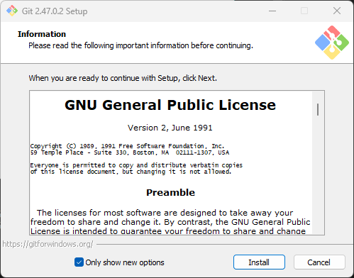
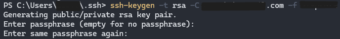
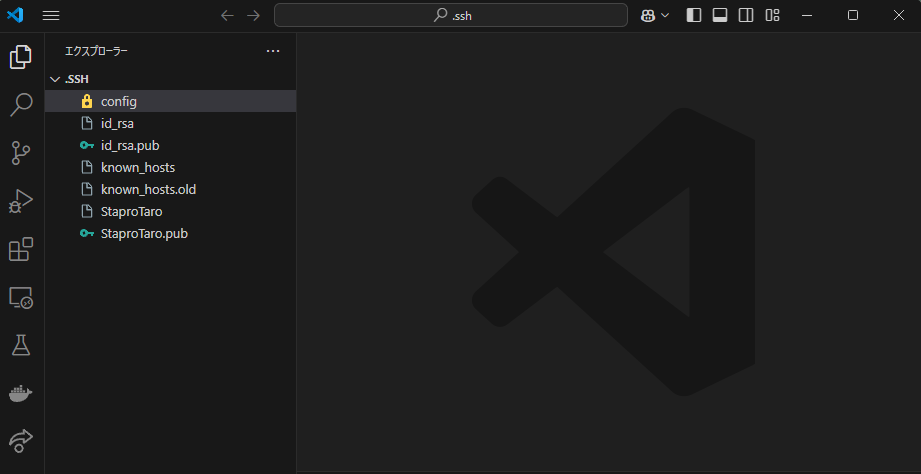
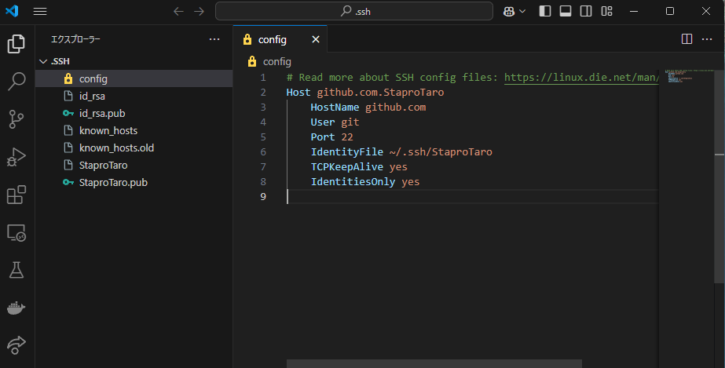
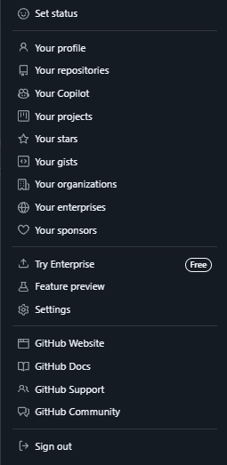
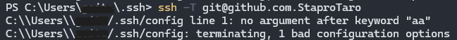

gitカリキュラム1
# GitとGithubについて知ろう

## Gitとは
Gitとはソースコードなどを管理・共有するために使うバージョン管理システムの事です。
Gitを使うとファイルのバージョンを管理することができ、仮にほかの誰かにプログラムを上書きされても、簡単にもとに戻すことができます。
開発の現場で幅広く利用されています。

## Githubとは
Githubとは開発者にとって欠かせない存在といっても過言ではありません。
世界中の人々がプログラムコードやデザインデータを保存・公開できるソースコード管理サービスの事です。
エンジニア同士がGithub上でソースコードを共有することによって履歴を残しながら更新をしたり、自分以外の人間が修正を加えたりできます。

---

## Gitの導入
今回カリキュラムで必要なGitを使用するためにGitをインストールする必要が有ります。

Windowsの場合とMacの場合でインストール方法が異なるため、WindowsとMacでの方法を下記に書いています。

ここからコードを入力する箇所がありますが、コピー&ペーストをしながら進めてください。

### **Windowsの場合**
#### 手順1
以下のGitのインストーラーをローカルにインストールしてください。

<a href="https://gitforwindows.org/" target="_blank">Git for Windows</a>

以下のような画面に遷移すると思います。



右下の青いボタンからDownloadをクリックしてください。

すると下記のように「Git-x.xx.x-64-bit.exe」がダウンロードされます。


#### 手順2
手順1にてダウンロードすることができた「Git-x.xx.x-64-bit.exe」をダブルクリックすることによって実行してください。

「Only show new options」と書いてあるところのチェックボックスを外すことによってオプションを細かく設定したりすることも可能ですが、今回は「install」と書いてあるボタンを押してください。



下記のように表示されたらインストールが完了しています。

Finishを押して表示されているウインドウを消してください。


Windowsボタンを押して「git」と検索したときに、「Git Bash」が表示されていたらインストール成功です。


### **Macの場合**

#### 手順1
Gitをローカル環境で開発するためにターミナルの用意が必要です。

ターミナルは標準でMacにインストールされています。

コマンドキーとスペースバーを同時に押すと、Spotlightというウインドウが開けます。

このウインドウに「たーみなる」と入力して、ターミナルというアプリケーションを開いてください。

#### 手順2
ターミナルが開けたら、以下のコマンドを実行してください。

```
git --version
```

それによって下記のような表示をされていればすぐにGitを使うことができるため、そのまま次に進んでください。

```
git version x.xx.x (Apple Git-xxx)
```

Gitのバージョンが表示されずに、以下のようなウインドウが表示された場合は、青いボタンの「インストール」を押してGitをインストールしましょう。


## Googleのアカウント作成
次にGithubというプラットフォームの登録をする際にGoogleのアカウントが必要になるため、Googleのアカウント作成をしましょう。

既に自分のアカウントを作っている人はそのGoogleのメールアドレスを使いましょう。

下記のGoogleアカウント作成の動画を見ながら、Googleのアカウントの作成をしましょう。

<iframe width="900" height="600" src="https://www.youtube.com/embed/fAEC-vEw4e4?si=Qu4mfmDd6U2730D0" title="YouTube video player" frameborder="0" allow="accelerometer; autoplay; clipboard-write; encrypted-media; gyroscope; picture-in-picture; web-share" referrerpolicy="strict-origin-when-cross-origin" allowfullscreen></iframe>


## Githubアカウント作成
次に先ほど作成したGoogleアカウントを使用してGithubアカウントの作成を行います。

下記のGithubの動画を見ながら、Githubアカウントの作成をしましょう。

<iframe width="900" height="600" src="https://www.youtube.com/embed/mHsA3QPO0YM?si=J3AzuCAg9PLrbr2D" title="YouTube video player" frameborder="0" allow="accelerometer; autoplay; clipboard-write; encrypted-media; gyroscope; picture-in-picture; web-share" referrerpolicy="strict-origin-when-cross-origin" allowfullscreen></iframe>


## Gitの設定

### ssh接続をする
まず、Githubのアカウントと現在操作しているPCを接続するためにssh接続をします。

このssh接続を行うことによってGithubに「この操作しているパソコンは私のだよ！」と安全に伝えることができます。

Windowsを使っている人はPowershell,Macを使っている人はターミナルを開きましょう。

開けたら、以下のコマンドを実行します。

```
cd ~/.ssh
```

実行できない場合は、下記のような結果になると思います。

```
cd: The directory '.ssh' does not exist
```

これは.sshという名前のフォルダが無いから移動することができないと言われています。
できない場合は、以下のコマンドを1行ずつ実行しましょう。

```
cd
mkdir .ssh
cd .ssh
```

実行することができたら、以下のコマンドを実行します。
```
ssh-keygen -t rsa -C Githubメールアドレス -f 自分の名前
```
以下のように、ファイルの保存場所を指定するように求められたり、パスワードを指定するように求められます。今回は、何も入力することなく「Enter」を押し続けてください。



これによってssh接続に必要なファイルが生成され、以下のように表示されます。

ssh接続については難しい内容であるためここでは詳しく説明しませんが、気になる人は「ssh接続とは」と調べたりしてみましょう。


他に追加しないといけない内容があるため、VSCodeを使って編集を行います。

以下のコマンドを実行しましょう。

そうするとVSCodeを開くことができます。

```
code .
```
<strong>command not found: codeと表示された場合</strong>

VSCodeを開き、shift + command + Pを押しましょう。

「> shell command」と入力すると"シェルコマンド：PATH内に'code'コマンドをインストールします"と"シェルコマンド：PATH内に'code'コマンドをアンインストールします"が表示されます。

"シェルコマンド：PATH内に'code'コマンドをインストールします"を押しましょう。

正常にインストールされたと表示されたら"code ."にて動くようになっているはずです。

---
</details>


左のファイルの中に先ほどのコマンドにて指定した自分の名前のファイルと自分の名前の後に「.pub」とついているファイルの2つが生成されていれば大丈夫です。

自分の名前の後に「.pub」と書いてあるファイルを開いて、その中に書いてあるものをすべてコピーしておいてください。



次にconfigという名前のファイルを作成しましょう。

もう既にconfigという名前のファイルが作成されている場合は新たに作成する必要はありません。

そして下記のようにconfigファイルの中に記述してください。

共用パソコンの場合はほかの生徒がconfigファイルに記述している可能性が有ります。

その場合は既にあるコードは削除せず改行をして記述するようにしてください。


```
Host github.com.自分の名前
    HostName github.com
    User git
    Port 22
    IdentityFile ~/.ssh/自分の名前
    TCPKeepAlive yes
    IdentitiesOnly yes
```
名前がStaproTaroの場合このようになります。
2行目と6行目が特に異なるはずです。



次はGithubを開きましょう。
作成したアカウントでログインすることができている状態にしてください。

右上のアイコンマークを押すと、下記のようなサイドバーが表示されます。

この中からSettingsを押してください。



Settingsのページに飛ぶと「SSH and GPG keys」という項目があると思います。
そこをクリックしてください。

緑色のボタンが右に二つあると思いますが、その中から「New SSH key」と書いてあるボタンを押しましょう。

そうすると下記のようなページに遷移するはずです。

Titleは自分の使っているPCがどんなPCかわかりやすいように書いておきましょう。

このTitleは何にしてもあまり問題はありませんが、使っているPCがどれかわかっていることが重要です。


Add SSH keyと書かれているところを押しましょう。

そしたらもう一度ターミナルに戻ります。
下記のコマンドを実行してください。

```
ssh -T git@github.com.自分の名前
```

実行したときに下記のように表示されていれば、Githubと使っているPCとの接続に成功していますが、下記の表示と違っていればこれまでした操作が間違えている可能性が有ります。


```
Hi {yourname}! You've successfully authenticated, but GitHub does not provide shell access.
```

「Are you sure you want to continue connecting (yes/no/[fingerprint])?」と表示された場合は、"yes"と入力し、Enterを押しましょう。

---
例えば下記のようなエラーが表示されたときは、configファイルの1行目に問題が有ると表示されています。



このようにエラー文を見ながらどこに原因があるのか探してみましょう。


これでカリキュラム1は終了です。
Gitカリキュラム2に進んでください。