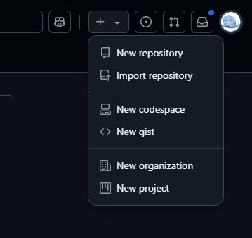
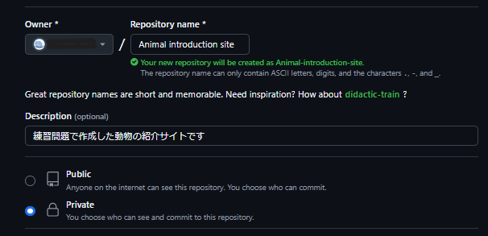
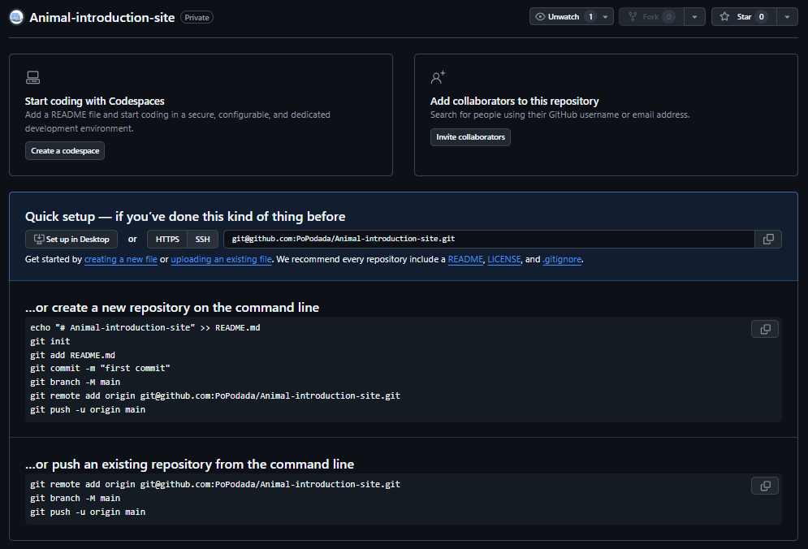
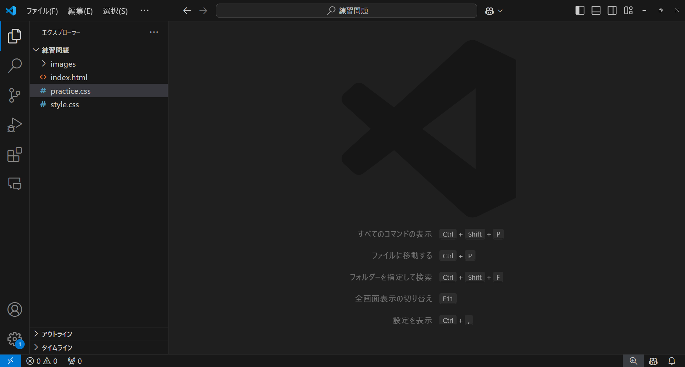
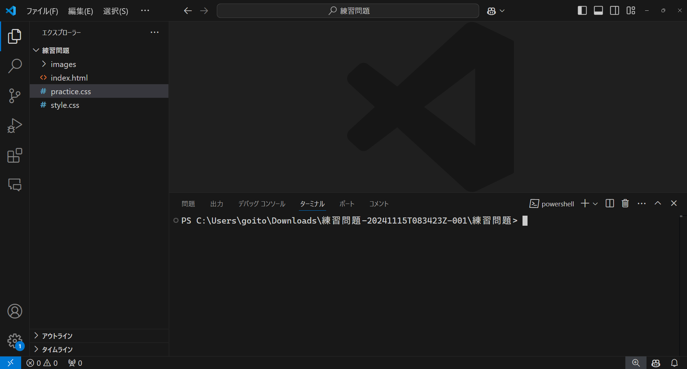
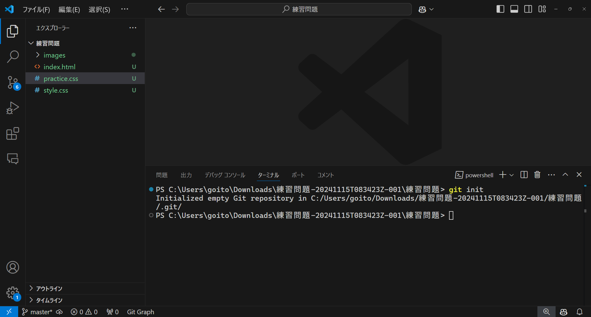
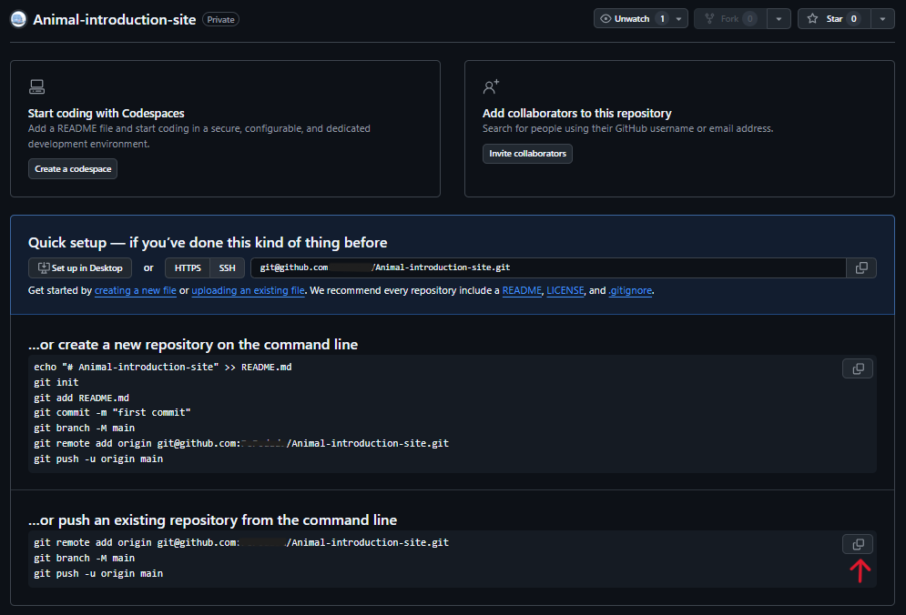
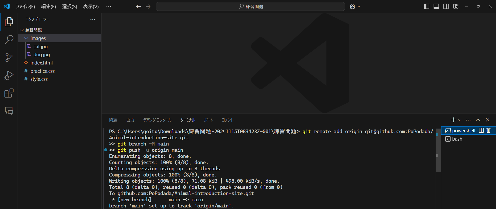
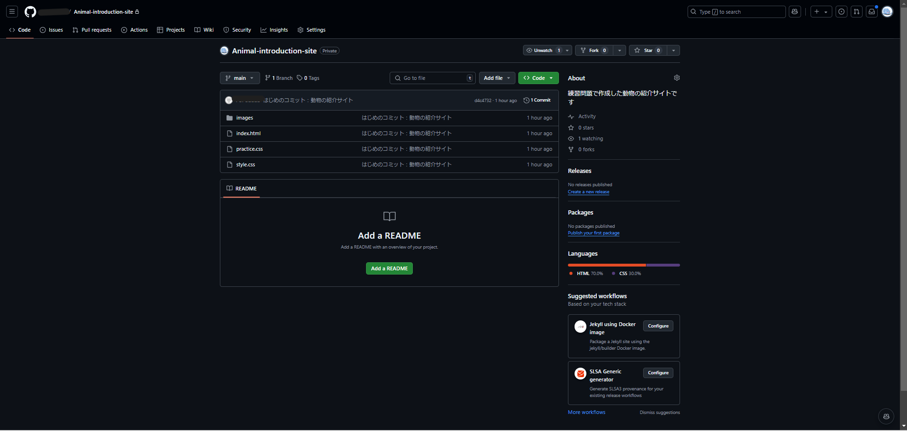

カリキュラム02

Githubに動物の紹介サイトを共有してみよう
=======================

実際にGithubに動物の紹介サイトを共有してみましょう。

今回使うコマンド
--------

今回使うGitのコマンドは下記の4つです。

このコマンド4つを使うことによってGithubに作ったものを共有することができます。

実際に一緒に動物の紹介サイトを共有していきましょう。

* git init
* git add
* git commit
* git push

Githubでリポジトリを作成しよう
------------------

コマンドの演習をする前に動物の紹介サイトを共有できるようにGithub上で準備をします。

<a href="https://github.com" target="_blank">Github</a>にアクセスし、ログインをしましょう。

ページの右上隅で+を選択し、「新しいリポジトリ」をクリックします。



リポジトリの初期設定を行える画面に遷移します。

今回は、Repository nameのところに「Animal introduction site」、Descriptionのところに「練習問題で作成した動物の紹介サイトです」と記述しましょう。



最後に緑色のボタンの「Create repositoy」を押してリポジトリを作成してください。

すると下記のページが表示されるはずです。



事前準備
--------

まず、動物紹介サイトのフォルダをVSCodeで開いてみましょう。

下記のようになっていれば正しいです。



Gitのコマンドを実行するために様々な方法が存在しますが、今回はターミナルにてコマンドを実行します。

コマンドを実行するためにターミナルを表示させてみます。

VSCodeではCtrl+jを押すとターミナルを表示させることができます。

Gitカリキュラム1で使用していたターミナルと同じものになりますが、VSCodeにて動物紹介サイトのフォルダを開いた状態でターミナルを開くと動物紹介サイトのフォルダの中に入っているものに対してコマンドを実行することができます。

下記のコマンドを1行ずつ実行しましょう。

このコマンドは、プロジェクトで作業をする際に作業している人の情報をGitに教えるために必要です。

このコマンドを実行していないとこれから学習するコマンドを実行した際に誰が作業しているか記録できないためエラーが出てしまいます。

Githubのアカウント名とGithubのメールアドレスと書かれている部分を自分の情報に変更しましょう。


```
git config --local user.name Githubのアカウント名
git config --local user.email Githubのメールアドレス
```

git init
--------

このコマンドを使うことによって、プロジェクトフォルダをGitの管理対象に設定します。これを「リポジトリの初期化」とも言います。

git initと入力して実行してみましょう。

```
git init
```

下記のように表示されるはずです。

```
Initialized empty Git repository in 〇〇
```


これによってリポジトリの初期化をすることができました。

具体的な実行結果は下記の通りになります。




git add
-------

git add は、作業中のファイルやフォルダを「Gitに保存する準備をする」ためのコマンドです。

言い換えると、「次に保存したい変更を選ぶ」作業です。

例えば、動物紹介サイトのフォルダ内で新しく作成したファイルや変更したファイルをGitに教えるために使います。

```
git add .
```

ここでの.(ドット)は「このフォルダの中にあるすべての変更ファイル」という意味です。

例えば今回は、「git add .」というコマンドを使用すると練習問題のフォルダの中に入っているファイルをすべて保存したい変更に指定することができます。

**例：特定のファイルだけを追加したい場合**

特定のファイルだけを選びたいときはファイル名を直接指定することができます

```
git add index.html
```

git commit
----------

git commitは、ステージに追加したファイルを「コミット」として記録します。

コミットで、どのような変更を行ったのか説明するメッセージをつけることができます。

例えば初めのコミットの場合は、以下のようにします。

```
git commit -m "初めのコミット：動物の紹介サイト"
```

このコマンドにより、ステージに追加した変更がコミットされ、Git上に記録されます。この記録によって後から変更内容を見返したり、必要に応じて過去のバージョンに戻すことができます。

git push
--------

最後にGithubに追加した変更をアップロードします。

リポジトリを作成したときに表示されたページから赤の矢印の部分を押して、コピーしてください。



そしてコピーしたコードをターミナルで実行してください。



実行を終わった後にGithubのページが以下のように表示されていればpushが成功しています。


```
git remote add origin git@github.com:xxxxxxxx/Animal-introduction-site.git
git branch -M main
git push -u origin main
```

「git push -u origin main」でGithubへのアップロードを行っています。




まとめ
---

今回は練習問題で作成したものをGithubに共有しました。

次からこのリポジトリに変更を加えてGithubを更新するときは、add,commit,pushの流れになります。

---

## よくあるエラーについて
カリキュラムを進めているときにカリキュラム通りに動かずエラーが出てしまうことがあると思います。

ここではよくあるエラーについて原因を説明します。

- 接続しているリポジトリが違っている
```
ERROR: Repository not found.
fatal: Could not read from remote repository.
Please make sure you have the correct access rights
and the repository exists.
```

このエラーはpushをしたときに「git push」のセクションにて実行した下記のようなコマンドが間違えていると表示されます。

pushしようとしているリポジトリとpush先のリポジトリが異なっていると起きるエラーです。

```
git remote add origin git@github.com:xxxxxxxx/Animal-introduction-site.git
```

今回のカリキュラムでは動物の紹介サイトをpushしますが、Githubにて見ているページやVSCodeで開いているフォルダが動物の紹介サイトで合っているか確認しましょう。

git initを実行したフォルダごとに接続するリポジトリを設定することができます。

動物紹介サイトVSCodeにて開き、Ctrl+jを押してターミナルをVSCodeにて開きましょう。

そこで下記のコマンドを実行して、接続しているリポジトリのURLを確認します。

```
git remote -v
```

そのあとに出力されたURLが登録している動物詳細サイトのものと一致しているか確認しましょう。

間違っている場合は正しいURLを設定し直すために下記のコマンドを実行しましょう。

```
git remote set-url origin 正しいURL
```

実行した後は接続しているリポジトリのURLをもう一度確認してpushしたいリポジトリと合っているか確認しましょう。


---

- 既に接続するリポジトリが登録されている
```
error: remote origin already exists.
remote: Repository not found.
```

このエラーは接続するリポジトリを登録しようとしたときに既に登録されていると表示されます。

動物紹介サイトVSCodeにて開き、Ctrl+jを押してターミナルをVSCodeにて開きましょう。

そこで下記のコマンドを実行して、接続しているリポジトリのURLを確認します。

```
git remote -v
```

そのあとに出力されたURLが登録している動物詳細サイトのものと一致しているか確認しましょう。

間違っている場合は正しいURLを設定し直すために下記のコマンドを実行しましょう。

```
git remote set-url origin 正しいURL
```

実行した後は接続しているリポジトリのURLをもう一度確認してpushしたいリポジトリと合っているか確認しましょう。