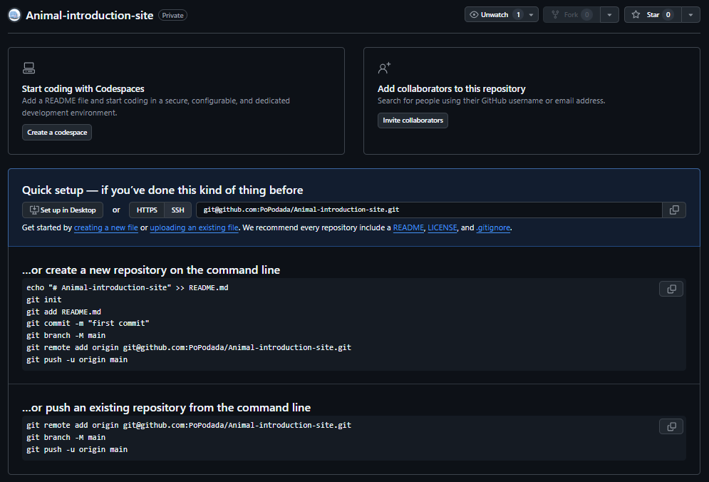
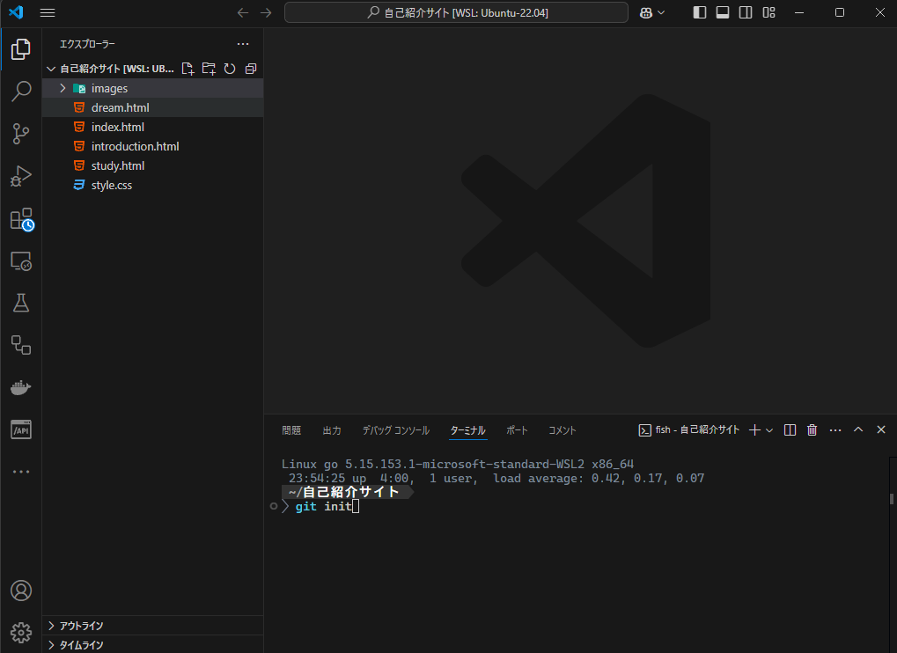

gitカリキュラム3
# 自己紹介サイトをGithubにpushしよう

HTML/CSSのカリキュラムにて自己紹介サイトを作成しました。
その自己紹介サイトをGithubにpushしてみましょう。

難しい場合は、gitカリキュラム2を参考にしてpushしましょう。

<details><summary>解説</summary>

### Githubでリポジトリを作成する
Githubにアクセスし、ページの右上隅で+を選択して「New repository」をクリックします。


今回は、Repository nameのところに「Self-introduction site」、Descriptionのところに「自己紹介サイトです」と記述しましょう。


最後に緑色のボタンの「Create repository」を押してリポジトリを作成してください。

すると下記のようなページが表示されるはずです。




### 作業する人の情報を登録する

自己紹介サイトのフォルダをVSCodeで開いた後にCtrl+jを押してターミナルを表示しましょう。

プロジェクトで作業する人の情報をGitに教える必要があります。

下記のコマンドを1行ずつ実行しましょう。

```
git config --local user.name "自分の名前"
git config --local user.email "Githubのメールアドレス"
```

### プロジェクトフォルダの初期化をする
git initを使用して自己紹介サイトのフォルダをGitの管理対象にします。



```
git init
```
git initと入力し初期化を行いましょう。

### 変更を追加した内容を選択する
git addを使用して次のコミットにて記録する内容を選択します。

```
git add .
```

git addと入力し次のコミットにて記録する内容を選択しましょう。
addの後に.(ドット)を使用することによって、すべての変更を保存したい内容として選択することができます。

### コミットをして追加した内容を記録する
git commitを使用してaddにて追加した内容がどういった内容なのか説明を加え記録します。

```
git commit -m "初めのコミット：自己紹介サイト"
```

### Githubに追加した変更をアップロードする

リポジトリを作成したときに表示されたページから赤の矢印の部分を押して、コピーを行ってください。


コピーした内容をすべてターミナルにて実行しましょう。
```
git remote add origin git@github.com:xxxxx/Self-introduction-site.git
git branch -M main
git push -u origin main
```

pushをした内容がGithubにて確認することができればpushに成功しています。