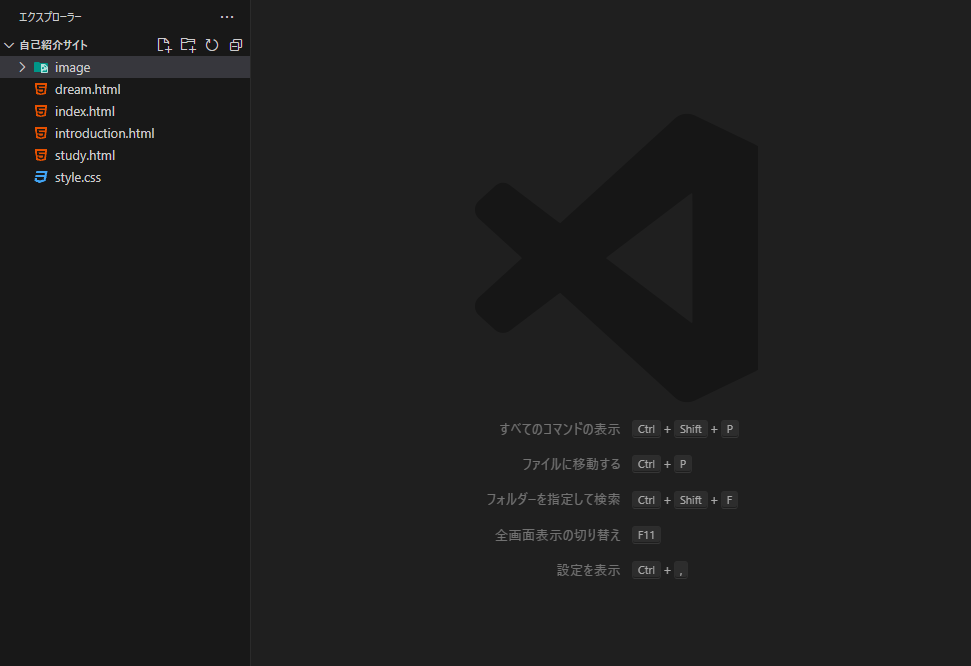
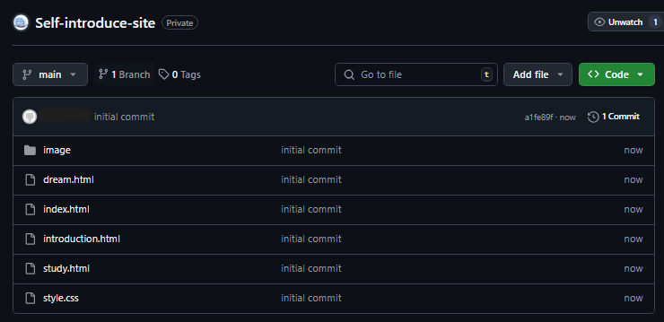
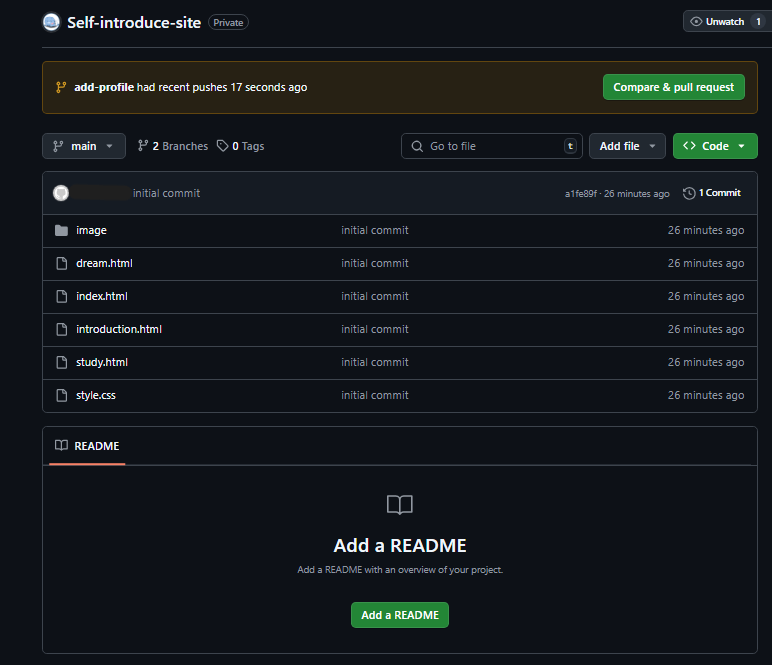
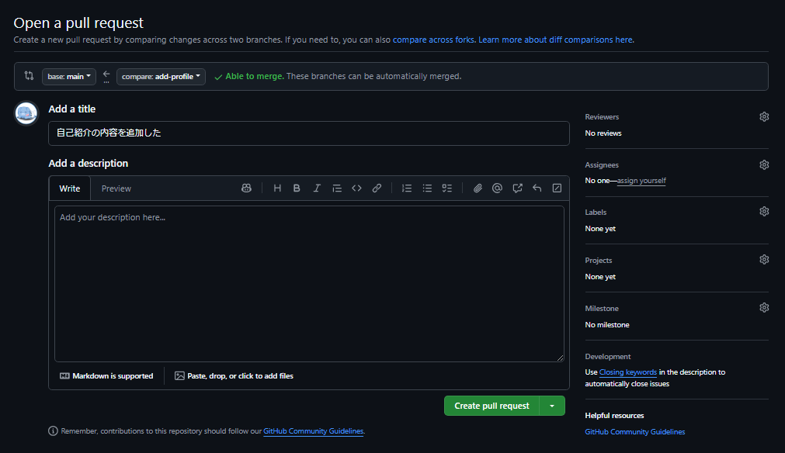

gitカリキュラム4
# ブランチを切ってコードを書こう

カリキュラム4では、ブランチという仕組みを学習します。
## ブランチとは

ブランチは、プロジェクトのコードや履歴を複製することによって、別の作業を進められる仕組みの事です。

例えば、プロジェクトは木の幹のことであって、ブランチはそこから伸びる枝の事です。
枝の部分で作業したとしてもプロジェクトの木の幹の部分は影響を受けません。

## どのようなときにブランチを使うのか

複数人で開発を行うときにブランチを使うと効率的に開発を進めることができます。
全員がプロジェクトの木の幹で作業を行ってしまうと作業をしている場所がかぶってしまうからです。

プロジェクトの幹の部分を公開したまま作業してしまうと、途中まで進めている状態が公開されてしまうことになります。
枝の部分で作業していれば公開しているものに影響することなく作業することができます。

## ブランチを切って作業をしてみよう

カリキュラム4では、gitカリキュラム3にて以前Githubにプッシュした自己紹介サイトを使用して、ブランチの練習をします。
今回は簡単に自己紹介サイトに項目を追加していきます。
まず、自己紹介サイトのフォルダをVSCodeにて開いてみましょう。

このようになっていれば無事操作できています。



また、この自己紹介サイトは既にGithubにプッシュされている必要が有ります。
プッシュの方法についてはgitカリキュラム3にて解説しています。

Githubにて手元にある自己紹介サイトと同じようなフォルダが確認できればプッシュできています。



早速ブランチを切って作業してみましょう。
自己紹介サイトを開いているVSCodeにてCtrl+jを押して、ターミナルを開いてください。
下記のコマンドを実行してみましょう。

```
git branch 
```

これによってブランチの一覧を見ることができます。
mainと書いてあるところに*が書いてあれば今いるブランチはメインブランチであるということになります。
このメインブランチがプロジェクトの木の幹といわれる部分です。

次にブランチを切ります。
```
git switch -c {ブランチ名}
```
ブランチ名を自分で決めて新しくブランチを作成することができます。
メインブランチからブランチを作成するとメインブランチで今作っているものもコミットした履歴も同じものが新しいブランチに引き継がれます。

今回は自己紹介サイトのプロフィールの部分にもう少し内容を追加してみます。
なのでブランチ名は「add-profile」としておきましょう。

```
git switch -c add-profile
```

コマンドを実行してみたら先ほどのブランチの一覧を見るコマンドを使ったりしながらブランチがちゃんとできているか確認しましょう。

今回は少しだけ自己紹介のプロフィールの部分に追加をしてみます。
簡単にプロフィールの中に趣味、好きなゲームといったような内容を追加してみましょう。

内容を追加することができたら、add,commit,pushを使用して、コードを追加した履歴を追加します。
コミットの「プロフィールの内容を追加した」は例です。
自由にわかりやすく何を変更したのか書いてみましょう。

```
git add .
git commit -m "プロフィールの内容を追加した"
git push origin {作成したブランチ名}
```

上記のコマンドの3行目を実行することができればプッシュすることができています。

## マージしよう

Githubの自己紹介サイトのページを見てみましょう。
このように黄色い背景で「{作成したブランチ名} had recent pushes ...」と書いてあるはずです。



緑色の「Compare & pull request」を押してみましょう。

これによって新しく作ったブランチでした作業をメインブランチに反映させようとしています。これをマージといいます。

チーム開発でこのような作業をするときはほかの人にちゃんとプログラムが書けているか確認してもらってからマージしたりします。



このようなページに遷移していたら、「Create pull request」を押してみましょう。

これによって、マージしようとしているブランチが正しい作業になっているか他者に確認してもらいます。

実際に、メンターに変更した内容を見てもらいましょう。
確認してもらえればマージしましょう。
「Merge pull request」というボタンを押すとマージすることができます。

## まとめ

このカリキュラムにてブランチを作成して作業を行い、それをプッシュしてプルリクエストを出し、マージするといった一連の流れを学習することができました。

何度か練習をしていくと理解できるようになるため、ほかのカリキュラムで作成したコードなどもこの一連の動作を使ってGithubにプッシュしたりしてみましょう。


